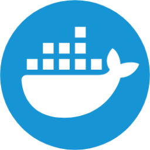

#   Containers

> [!note]
> Obrazy kontenerowe to samowystarczalne pakiety zawierające aplikację, jej zależności, system plików oraz konfigurację. Są niezmienne, przenośne i mogą być uruchamiane w kontenerach na różnych systemach, zapewniając spójność działania niezależnie od środowiska. Dzięki nim aplikacje mogą być łatwo wdrażane, skalowane i izolowane od reszty systemu.

## Lista komponentów

| container | version | description |
|-----------|---------|-------------|
| [ansible](https://gitlab.com/pl.rachuna-net/containers/ansible) |  | Obraz Dockerowy z Ansible i Molecule. |
| [buildah](https://gitlab.com/pl.rachuna-net/containers/buildah) |  | Kontener z narzędziem Buildah, wykorzystywany w procesach budowania kontenerów w środowisku GitLab CI. |
| [conftest](https://gitlab.com/pl.rachuna-net/containers/conftest) |  | Obraz Dockerowy z conftest |
| [mkdocs](https://gitlab.com/pl.rachuna-net/containers/mkdocs) |  | Obraz Dockerowy z MkDocs. |
| [packer](https://gitlab.com/pl.rachuna-net/containers/packer) |  | Obraz Dockerowy z Packer. |
| [python](https://gitlab.com/pl.rachuna-net/containers/python) |  | Obraz Dockerowy z Python. |
| [semantic-release](https://gitlab.com/pl.rachuna-net/containers/semantic-release) |  | Kontener z narzędziem Semantic-Release. |
| [sonar-scanner](https://gitlab.com/pl.rachuna-net/containers/sonar-scanner) |  | Obraz Dockerowy z narzędziem Sonar Scanner do analizy kodu źródłowego. |
| [terraform](https://gitlab.com/pl.rachuna-net/containers/terraform) |  | Obraz Dockerowy z narzędziem Terraform. |
| [trivy](https://gitlab.com/pl.rachuna-net/containers/trivy) |  | Obraz Dockerowy z narzędziem trivy |
| [vault](https://gitlab.com/pl.rachuna-net/containers/vault) |  | Obraz Dockerowy z narzędziem Vault |

---
## Contributions
Jeśli masz pomysły na ulepszenia, zgłoś problemy, rozwidl repozytorium lub utwórz Merge Request. Wszystkie wkłady są mile widziane!
[Contributions](CONTRIBUTING.md)

---
## License
Projekt licencjonowany jest na warunkach [Licencji MIT](LICENSE).

---
# Author Information
### &emsp; Maciej Rachuna
# 